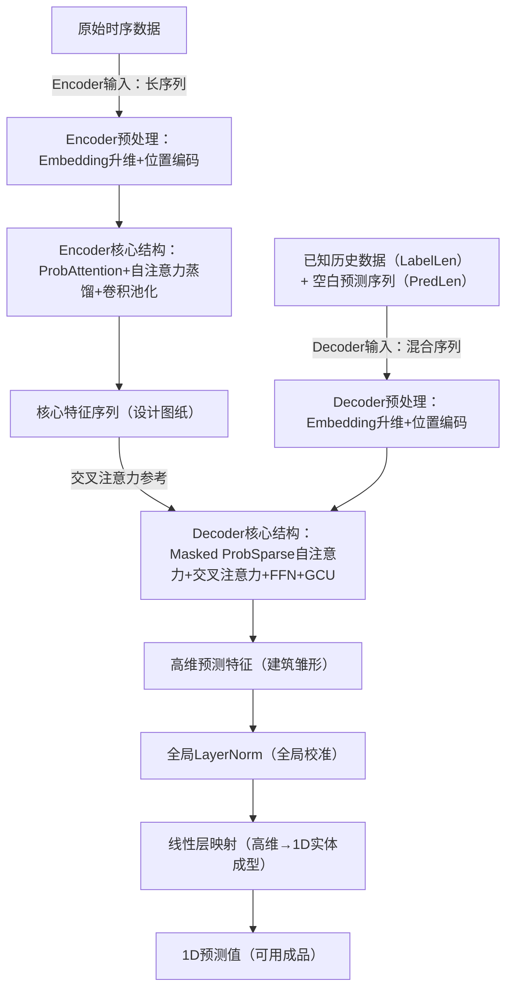

Informer的整个预测流程是“**设计→施工→成品交付**”的闭环：Encoder作为“核心设计部门”，从原始长序列中提炼出“精简设计图纸”（核心特征）；Decoder作为“智能施工团队”，以“设计图纸”和“已完工基础结构”（已知历史数据）为依据，通过分层精细化施工生成“完整建筑”（预测结果）；最终通过“成品校准+成型”输出可用的1D预测值。

## 一、Encoder：设计阶段——从“实景扫描”到“精简设计图纸”

Encoder的核心目标是**“去粗取精”**：接收海量原始时序数据（如10000个时间步的传感器数据），通过多层“筛选-精简-压缩”操作，输出长度短、信息密度高的核心特征序列，类比“3D建模师从实景激光扫描的百万个点云中，提炼出只保留关键结构的精简模型图纸”。

### 1. 输入与预处理：原始数据“数字化”

- **输入**：原始长序列时序数据（如温度、电力负荷，维度为[序列长度L, 原始特征数]）。
- **预处理两步走**：
    1. **Embedding嵌入层（升维）**：将原始低维特征（如单个温度值）映射为高维向量（如64维），类比“将2D照片的像素点转化为3D建模的可编辑顶点坐标”——让数据具备“可加工的结构属性”。
    2. **Positional Encoding位置编码**：给每个高维向量添加“时序位置标签”，类比“给3D顶点打上空间坐标标签”——确保模型理解“时间先后顺序”（如“昨天的温度”和“今天的温度”的位置差异）。
- **预处理输出**：带位置信息的高维特征序列（维度为[L, 64]），相当于“实景扫描的数字化点云”。

### 2. 核心结构：多层堆叠的“精炼流水线”（通常3-6层）

每层是一条“筛选-精简-压缩”的流水线，层与层递进优化，且每层都通过“LayerNorm+残差连接”校准误差（类比“每道工序后用激光校准尺寸，确保不偏离设计”）。每层核心包含3个关键模块：

1. **多头ProbAttention（重点区域筛选）**：
不做全局无差别计算，而是通过“概率采样”聚焦关键关联。具体来说，从Key（键向量，对应“点云中的参考点”）中随机采样少量关键样本（数量为c·ln(L)，如L=10000时采样约50个），再筛选出对这些Key“关注度高”的活跃Query（查询向量，对应“建模的目标点”），仅计算活跃Query与采样Key的注意力。
类比“3D建模师不打磨所有点云，只聚焦人物面部、建筑轮廓等关键区域，忽略背景杂草、远处光斑”——将计算量从O(L²)降至O(L log L)，解决长序列计算爆炸问题。
2. **自注意力蒸馏（冗余信息剔除）**：
在ProbAttention的结果上，进一步筛选“高价值注意力对”（如保留权重Top-30%的Query-Key对），删掉“弱关联冗余”（如“温度”与“无关噪声”的低权重关联）。类比“3D建模师删除模型中的重复顶点、微小凸起，让模型更轻量且结构清晰”。
3. **卷积+池化（特征压缩与平滑）**：
用3x3卷积核融合局部特征（类比“用砂纸打磨模型表面，去除毛刺让结构更连贯”），再通过步长为2的池化层将序列长度减半（如10000→5000）。类比“将1:1的模型按1:2比例缩小，保留整体结构但减少顶点数”——实现“特征压缩”，进一步降低后续计算成本。

### 3. Encoder输出：核心特征序列（精简设计图纸）

经过3层堆叠后，序列长度压缩为原始的1/8（如10000→1250），维度仍为64维，输出为[1250, 64]的核心特征序列。类比“建模师输出的A3尺寸精简图纸——只画关键结构，不冗余但信息完整”，供Decoder作为“施工依据”。

## 二、Decoder：施工阶段——从“设计图纸”到“完整建筑雏形”

Decoder的核心目标是**“按图施工”**：接收“已知历史数据”（如前48小时的温度，类比“已完工的建筑框架”）和“待预测空白序列”（如后24小时的占位符，初始为0，类比“待施工的空白区域”），结合Encoder的“设计图纸”，通过分层精细化操作生成“建筑雏形”（高维预测特征）。

### 1. 输入与预处理：施工“蓝图”准备

- **输入**：两部分拼接的混合序列（维度为[已知长度LabelLen + 预测长度PredLen, 原始特征数]）：
    1. 已知历史数据（LabelLen）：如前48小时的真实温度，是“施工的基础依据”。
    2. 空白预测序列（PredLen）：如后24小时的0值占位符，是“需要施工的目标区域”。
- **预处理**：与Encoder完全一致的“Embedding升维+Positional Encoding”，将混合序列转化为[LabelLen+PredLen, 64]的高维特征序列——类比“将‘已完工框架+待施工区域’的蓝图转化为3D打印的数字模型”。

### 2. 核心结构：三层堆叠的“智能施工流水线”

Decoder采用固定3层堆叠（精度与效率的平衡），每层是“约束施工→参考图纸→细节优化”的流水线，**每个子模块后都有LayerNorm+残差连接**（类比“每道施工工序后校准尺寸，避免层间错位”）。每层核心包含3个关键模块：

1. **Masked ProbSparse自注意力（带约束的局部施工）**：
这是Decoder的“施工纪律”——通过“下三角掩码”强制每个时间步只能关注左侧的“已知数据”（已完工部分），不能访问右侧的“空白序列”（未施工部分），避免“偷看未来”。同时通过ProbSparse采样聚焦关键关联（如用前48小时的温度趋势推导第49小时的温度）。
类比“3D打印时，只能根据已打印的底座推导下一步的墙体形状，不能提前看屋顶设计——确保施工符合时序逻辑”。**QKV计算逻辑**：Q、K、V均来自当前层的输入序列（混合序列的高维特征）——Q是“当前施工节点的需求”（如第49小时需要什么温度特征），K是“已完工节点的标识”（如第48小时的温度特征标识），V是“已完工节点的材料细节”（如第48小时的温度具体特征），仅计算Q与左侧K的注意力权重，再结合V生成施工结果。
2. **交叉注意力（参考设计图纸校准）**：
解决“局部施工可能偏离全局风格”的问题——将Encoder输出的“核心特征序列”（设计图纸）作为K和V，当前层自注意力的输出作为Q，通过Q与K的关联计算，让局部施工贴合全局趋势。
类比“施工队每砌完一段墙体，就对照设计师的精简图纸校准——确保墙体高度、门窗位置符合全局风格，不会出现‘局部合理但全局离谱’的问题”。**QKV计算逻辑**：Q来自Decoder前一步自注意力的输出（局部施工结果），K和V来自Encoder的核心特征（设计图纸）——通过计算“局部施工结果”与“设计图纸”的匹配度，用设计图纸的细节（V）优化局部施工，确保全局一致性。
3. **前馈网络（FFN）+ 门控卷积（GCU）（细节打磨与去冗余）**：
FFN对注意力输出的特征做非线性变换，类比“用工具细化墙体表面纹理”；GCU通过门控机制筛选有用信息，删掉“施工噪音”（如传感器偶然误差导致的异常特征），类比“用模板剔除墙体表面的多余凸起”——两者结合让“施工雏形”更精细、更干净。

### 3. Decoder三层堆叠输出：高维预测特征（建筑雏形）

经过3层递进优化后，输出维度为[PredLen, 64]的高维特征序列——类比“3D打印完成的建筑雏形，是包含所有结构细节的数字模型，但还未转化为实体”。

## 三、最终预测：成品交付——从“建筑雏形”到“可用实体”

Decoder三层堆叠输出的“高维雏形”仍需两步“成品处理”，才能转化为可用的1D预测值（如未来24小时的具体温度），类比“3D打印雏形的‘全局校准+实体成型’”。

### 1. 第一步：全局LayerNorm（全局校准）

对三层堆叠输出的高维特征做“全局归一化”，将所有时间步的特征值调整到统一范围（如均值0、方差1），类比“3D打印完成后，用全局尺子校准整体尺寸——避免层间校准的微小偏差累积导致建筑整体偏高/偏低”，确保特征分布稳定，为后续转化做准备。

### 2. 第二步：线性层映射（高维→1D实体成型）

通过一个线性变换矩阵（维度为[64, 1]），将每个时间步的64维高维特征“压缩”为1维具体数值（如温度值）。数学上，对每个时间步的特征向量`x`（64维），计算`y = x·W + b`（`W`为64×1的权重矩阵，`b`为偏置），直接输出维度为[PredLen, 1]的1D序列。

类比“3D打印的数字雏形（高维特征）通过‘实体化喷头’（线性层）转化为可触摸的实体建筑（1D具体数值）——喷头的参数（权重矩阵）决定了数字模型如何精准映射为实体尺寸”。

## 四、全流程闭环总结（设计-施工-交付）

1. **设计阶段（Encoder）**：原始时序数据 → 预处理（Embedding+位置编码）→ 多层（ProbAttention+蒸馏+卷积池化）→ 核心特征序列（设计图纸）。
2. **施工阶段（Decoder）**：已知数据+空白序列 → 预处理（Embedding+位置编码）→ 三层（Masked ProbSparse自注意力+交叉注意力+FFN+GCU）→ 高维预测特征（建筑雏形）。
3. **交付阶段（最终预测）**：高维特征 → 全局LayerNorm（全局校准）→ 线性层（1D成型）→ 1D预测值（可用成品）。

整个流程通过“Encoder精简信息、Decoder分层精准施工、最终校准成型”，既解决了传统Transformer长序列计算爆炸的问题，又确保预测结果“贴合全局趋势、细节精准”，完美适配天气预报、电力负荷预测等长序列场景。

