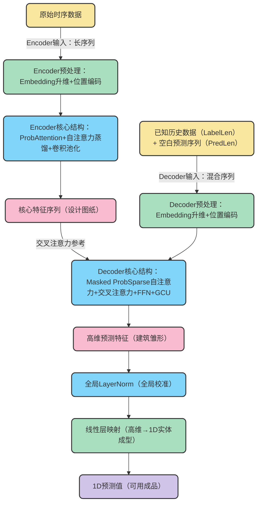

```mermaid
graph TD
    %% 定义样式类
    classDef styleInput fill:#F9E79F,stroke:#333,stroke-width:2px,rx:8px,ry:8px;
    classDef styleProcess fill:#A9DFBF,stroke:#333,stroke-width:2px,rx:8px,ry:8px;
    classDef styleCore fill:#81D4FA,stroke:#333,stroke-width:2px,rx:8px,ry:8px;
    classDef styleFeature fill:#F8BBD0,stroke:#333,stroke-width:2px,rx:8px,ry:8px;
    classDef styleOutput fill:#D1C4E9,stroke:#333,stroke-width:2px,rx:8px,ry:8px;
    
    %% 流程节点（绑定样式类）
    A["原始时序数据"]:::styleInput -->|Encoder输入：长序列| B["Encoder预处理：Embedding升维+位置编码"]:::styleProcess
    B --> C["Encoder核心结构：ProbAttention+自注意力蒸馏+卷积池化"]:::styleCore
    C --> D["核心特征序列（设计图纸）"]:::styleFeature
    
    E["已知历史数据（LabelLen）+ 空白预测序列（PredLen）"]:::styleInput -->|Decoder输入：混合序列| F["Decoder预处理：Embedding升维+位置编码"]:::styleProcess
    D -->|交叉注意力参考| G["Decoder核心结构：Masked ProbSparse自注意力+交叉注意力+FFN+GCU"]:::styleCore
    F --> G
    G --> H["高维预测特征（建筑雏形）"]:::styleFeature
    
    H --> I["全局LayerNorm（全局校准）"]:::styleCore
    I --> J["线性层映射（高维→1D实体成型）"]:::styleProcess
    J --> K["1D预测值（可用成品）"]:::styleOutput
```